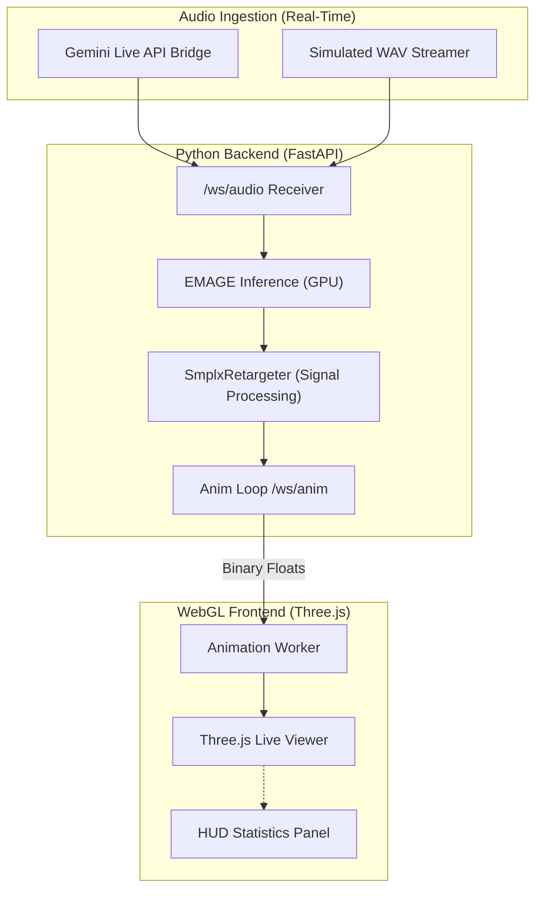

# 🕺 NPZ Generator & Real-Time SMPL-X Streaming Pipeline

[](https://ai.google.dev/)
[](https://reactjs.org/)
[](https://fastapi.tiangolo.com/)

An end-to-end pipeline for generating expressive SMPL-X motion from audio. This repository supports high-fidelity **offline NPZ generation**, **MP4 rendering**, and a **real-time WebSocket pipeline** for 3D avatar streaming (Gemini Live ready).

---

## ✨ Features

- **🎭 Expressive Motion Generation**: Uses the **EMAGE** (Expressive Motion Generation) architecture for synchronized body, face, hand, and global translation from raw audio.
- **⚡ Real-Time Streaming Pipeline**: A low-latency system that processes audio chunks via WebSockets and streams SMPL‑X vertices directly to a Three.js viewer.
- **📦 Offline NPZ Generation**: Batch process audio files in `./input` to high-fidelity animation coefficients.
- **📊 Advanced Post-Processing**: Features automatic gain control (AGC) for expressions, EMA smoothing for jitter-free motion, and jaw-scaling for crisp lip-sync.
- **🌐 Dual Visualization Suite**:
    - **Offline (Streamlit)**: High-performance local NPZ viewer.
    - **Live (Vite/React)**: Modern Three.js viewer for real-time streaming and interactive debugging.
- **🔗 Gemini Live Integration**: Pre-wired adapters to bridge Gemini PCM audio streams with the motion synthesis pipeline.

---

## 🚀 Quick Start

### 1. Environment Setup
Install the core Python dependencies (requires PyTorch and SMPL-X):
```bash
python3 -m pip install -r requirements.txt
```

### 2. Frontend Build (Optional for Live Streaming)
The live viewer resides in the `/frontend` directory and needs a production build:
```bash
# Export SMPL-X faces (requires smplx weights in 'models/')
python3 scripts/export_faces.py

# Build frontend
cd frontend && npm install && npm run build && cd ..
```
*Note: Exporting faces ensures that the Three.js viewer can render the avatar mesh correctly. The build command creates the `web/` directory that the FastAPI server uses for static hosting.*

### 3. Generate Motion (Offline)
Generate high-fidelity motion from your audio files in the `./input` folder:
```bash
python3 generate_npz.py --audio_folder ./input --save_folder ./output
```

### 4. Visualize Offline
Prefer a quick local view? Use the Streamlit or MP4 render paths:
- **Streamlit**: `python3 -m streamlit run visualize_web.py`
- **MP4 Render**: `python3 render.py` (Outputs `output.mp4`)

---

## ⚡ Real-Time Streaming Pipeline

Our streaming architecture allows you to live-stream audio to a server and get back animated vertices for immediate rendering.

### 1. Start the Live Server
```bash
# Set base FPS via environment variable
STREAM_FPS=15 python3 -m uvicorn server.app:app --reload --port 8000
```

### 2. Open the Live Viewer
The Three.js viewer will be live at: `http://localhost:8000/`.

### 3. Stream Audio (Example Simulator)
Use our utility script to simulate a live audio stream from a file:
```bash
python3 scripts/stream_audio_to_ws.py --audio ./input/your_audio.wav --chunk 0.5
```

---

## 🧠 System Architecture



---

## 📂 Project Structure

| Directory/File | Description |
| :--- | :--- |
| `frontend/` | React + Three.js application source code. |
| `web/` | Target for frontend build. Served by FastAPI. |
| `server/` | FastAPI server, WebSocket handlers, and Gemini adapters. |
| `emage_utils/` | Core EMAGE model implementation and VQ-VAE utils. |
| `scripts/` | Export utilities and audio streaming simulators. |
| `models/` | SMPL-X and EMAGE model weight storage path. |

---

## 🛠️ Advanced Configuration

Fine-tune your animation quality via CLI or config files:

- **Signal Processing**:
  - `expression_target`: Scales facial PCA coefficients for quiet audio.
  - `expression_smooth_alpha`: Alpha value for EMA smoothing (default: `1.0`).
- **Pipeline Performance**:
  - `overlap_sec`: Controls chunk overlap for seamless motion blending (default: `0.25s`).
  - `STREAM_FPS`: Sets the target animation rate for real-time vertex streaming (default: `20`).

---

## 🌩️ Gemini Live Integration (Stub)
Integration for high-fidelity audio/motion bridges is pre-wired:
```python
from server.gemini_adapter import GeminiAudioBridge

bridge = GeminiAudioBridge(sample_rate=16000)
payload = bridge.build_audio_payload(pcm_bytes, chunk_id="42")
# Send the payload to the /ws/audio endpoint
```

---

## 🧪 Testing Checklist
1. [ ] Run `python3 generate_npz.py` and verify `output/intro_output.npz`.
2. [ ] Run `python3 render.py` and check `output.mp4`.
3. [ ] Run `npm run build` in the frontend directory.
4. [ ] Start the uvicorn server and open the live viewer at `localhost:8000`.
5. [ ] Run `stream_audio_to_ws.py` and observe smooth 3D motion in the browser.

---

## 📜 Credits & References
- **EMAGE**: Expressive Motion Generation from Audio via Latent Cross-Modal Transformer.
- **SMPL-X**: A joint body, face, and hand model for human motion research.
- **Three.js**: The rendering system for the real-time WebGL viewer.
