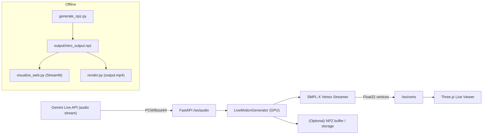

# NPZ Generator 🕺

Generate expressive SMPL‑X motion from audio, visualize offline, and run a real‑time streaming 3D avatar pipeline (Gemini Live ready).

---

## 🚀 Quick Start

### 1. Install Dependencies
```bash
python3 -m pip install -r requirements.txt
```

### 2. Generate Motion (Offline)
Put audio files in `./input`, then run:
```bash
python3 generate_npz.py
```
This writes `output/intro_output.npz`.

### 3. Visualize (Offline)
Streamlit viewer:
```bash
python3 -m streamlit run visualize_web.py
```
MP4 render:
```bash
python3 render.py
```
This writes `output.mp4`.

---

## ⚡ Real‑Time Streaming (Live Pipeline)

This repo now includes a real‑time pipeline that:
1. Accepts audio chunks over WebSocket.
2. Generates SMPL‑X coefficients in chunks.
3. Computes SMPL‑X vertices server‑side.
4. Streams vertices to a Three.js live viewer.

### Start the WebSocket Server
```bash
uvicorn server.app:app --reload --port 8000
```

### Open the Live Viewer
Open:
```
http://localhost:8000/
```

### Stream Audio (Simulator)
```bash
python3 scripts/stream_audio_to_ws.py --audio input/your_audio.wav --chunk 0.5
```

### Export Faces (One‑Time)
Three.js needs the SMPL‑X faces index list:
```bash
python3 scripts/export_faces.py
```
This writes `web/faces.json`.

---

## 🧠 System Architecture



---

## 🧩 Key Components

**Streaming core**
- `live_streaming_pipeline.py`
- `LiveMotionGenerator`: loads models once, processes audio chunks at ~30 FPS.
- `SmplxVertexStreamer`: computes SMPL‑X vertices server‑side.

**WebSocket server**
- `server/app.py`
- `/ws/audio` receives `{chunk_id, sr, dtype, audio_b64}`
- `/ws/verts` streams vertex frames as binary float32 arrays

**Gemini adapter (stub)**
- `server/gemini_adapter.py`
- `GeminiAudioBridge` formats PCM for `/ws/audio`

**Live viewer**
- `web/index.html`, `web/app.js`
- Three.js viewer with white background and soft lighting (matches `output.mp4`)

---

## ✅ Visual Style (Matches `output.mp4`)

The live viewer and Streamlit viewer are configured to:
- Use a clean white background.
- Disable axes/grids by default.
- Use soft, front‑biased lighting.
- Render a light gray mesh with smooth shading.

---

## 🛠️ Advanced Configuration

**Offline generation**
- `generate_npz.py --audio_folder ./input --save_folder ./output`
- `--no_visualization` to skip rendering during generation
- `--model_folder ./models`

**Streaming**
- `LiveMotionGenerator(overlap_sec=0.25)` controls overlap smoothing
- `stream_audio_to_ws.py --chunk 0.5` controls chunk duration

---

## 🌩️ Gemini Live Integration (Stub)

Real Gemini API integration is stubbed and ready to wire:
```python
from server.gemini_adapter import GeminiAudioBridge

bridge = GeminiAudioBridge(sample_rate=16000)
payload = bridge.build_audio_payload(pcm_bytes, chunk_id="42")
# Send payload to /ws/audio
```

---

## 🧪 Testing Checklist

1. `python3 generate_npz.py` generates `output/intro_output.npz`
2. `python3 render.py` writes `output.mp4`
3. Streamlit viewer runs without flicker or dark artifacts
4. `uvicorn server.app:app --reload --port 8000`
5. `python3 scripts/stream_audio_to_ws.py --audio input/your_audio.wav --chunk 0.5`
6. Viewer updates smoothly and matches `output.mp4` tone

---

## 📦 Requirements

All dependencies are captured in `requirements.txt`:
```bash
python3 -m pip install -r requirements.txt
```
